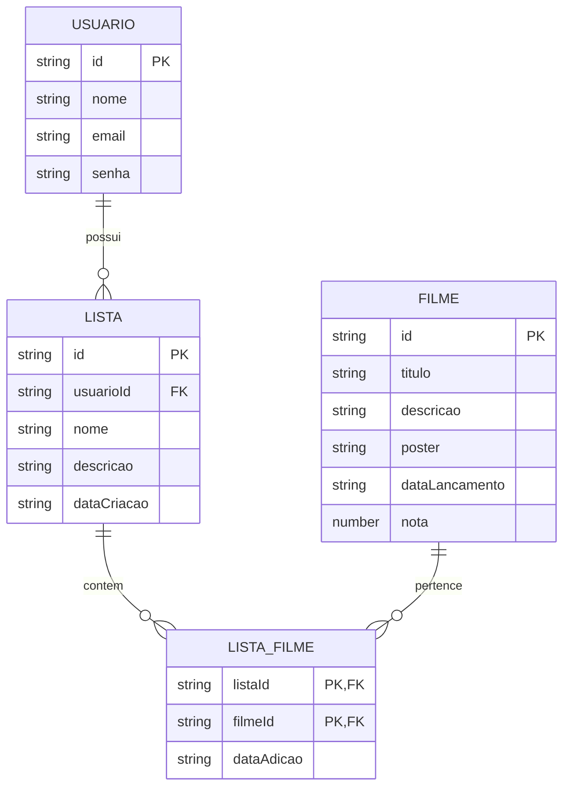

# 🎬 StreamList — Tech Spec

> Especificação técnica da plataforma **StreamList**, destinada à descoberta, organização e gerenciamento de filmes.

---

## 📋 Sumário

* [Visão Geral](#-visão-geral)
* [Arquitetura](#-arquitetura)
* [Modelo de Dados](#-modelo-de-dados)
* [Dicionário de Dados](#-dicionário-de-dados)
* [Relacionamentos](#-relacionamentos)
* [API de Filmes](#-api-de-filmes)
* [Tecnologias](#-tecnologias)
* [Comunicação entre Camadas](#-comunicação-entre-camadas)
* [Estrutura do Projeto](#-estrutura-do-projeto)

---

## 🎯 Visão Geral

O **StreamList** é uma aplicação web voltada para a **descoberta e organização de filmes**.

A plataforma permite que usuários:

* 🔎 Consultem filmes disponíveis no catálogo;
* 🎬 Visualizem informações detalhadas sobre os filmes;
* 📋 Criem listas personalizadas;
* ➕ Adicionem filmes às suas listas;
* ⭐ Organizem seus filmes favoritos;
* 👤 Gerenciem suas próprias listas.

As informações relacionadas ao catálogo de filmes serão obtidas por meio de uma **API externa**, enquanto os dados específicos dos usuários e de suas listas serão armazenados no banco de dados da aplicação.

---

# 🏗️ Arquitetura

O StreamList será organizado seguindo uma arquitetura dividida em três camadas principais:

```text
┌─────────────────────────────┐
│          FRONTEND           │
│                             │
│ Vue 3 + Vite + Pinia        │
│ Axios + HTML5 + CSS3        │
└──────────────┬──────────────┘
               │
               │ HTTP / API
               ▼
┌─────────────────────────────┐
│           BACKEND           │
│                             │
│ PHP                         │
│ Regras de negócio           │
│ Autenticação                │
└──────────────┬──────────────┘
               │
               │ SQL
               ▼
┌─────────────────────────────┐
│        BANCO DE DADOS       │
│                             │
│ MySQL                       │
│ Usuários                    │
│ Listas                      │
│ Relações lista/filme        │
└─────────────────────────────┘

               │
               │ HTTP
               ▼
┌─────────────────────────────┐
│       API DE FILMES         │
│                             │
│ Catálogo externo            │
│ Informações dos filmes      │
└─────────────────────────────┘
```

### Responsabilidades

| Camada            | Responsabilidade                                          |
| ----------------- | --------------------------------------------------------- |
| **Frontend**      | Interface, navegação e interação com o usuário            |
| **Backend**       | Regras de negócio, autenticação e comunicação com o banco |
| **MySQL**         | Persistência dos dados da aplicação                       |
| **API de Filmes** | Fornecimento das informações do catálogo                  |

---

# 🗃️ Modelo de Dados

O modelo de dados do StreamList é composto por quatro entidades principais:

* `USUARIO`
* `FILME`
* `LISTA`
* `LISTA_FILME`

O relacionamento entre **LISTA** e **FILME** é do tipo **muitos-para-muitos (N:N)**. Por isso, a entidade intermediária `LISTA_FILME` é utilizada para representar essa relação.

## 📐 Diagrama Entidade-Relacionamento



---

# 📖 Dicionário de Dados

## 👤 USUARIO

Armazena os dados necessários para identificação e autenticação dos usuários.

| Campo   | Tipo   | Chave | Descrição                            |
| ------- | ------ | ----- | ------------------------------------ |
| `id`    | string | PK    | Identificador único do usuário       |
| `nome`  | string | —     | Nome utilizado pelo usuário          |
| `email` | string | —     | E-mail utilizado para identificação  |
| `senha` | string | —     | Credencial utilizada na autenticação |

### Responsabilidade

A entidade `USUARIO` representa as pessoas que utilizam o StreamList e possuem listas personalizadas de filmes.

---

## 🎬 FILME

Representa os filmes consultados e utilizados pela aplicação.

| Campo            | Tipo   | Chave | Descrição                       |
| ---------------- | ------ | ----- | ------------------------------- |
| `id`             | string | PK    | Identificador único do filme    |
| `titulo`         | string | —     | Título do filme                 |
| `descricao`      | string | —     | Sinopse ou descrição            |
| `poster`         | string | —     | URL da imagem do pôster         |
| `dataLancamento` | string | —     | Data de lançamento              |
| `nota`           | number | —     | Avaliação ou pontuação do filme |

### Responsabilidade

A entidade `FILME` representa as informações necessárias para exibição e organização dos filmes dentro da aplicação.

> **Observação:** os dados do catálogo podem ser obtidos diretamente de uma API externa, não sendo obrigatório armazenar todas essas informações no banco de dados.

---

## 📋 LISTA

Representa uma coleção personalizada criada por um usuário.

| Campo         | Tipo   | Chave | Descrição                      |
| ------------- | ------ | ----- | ------------------------------ |
| `id`          | string | PK    | Identificador único da lista   |
| `usuarioId`   | string | FK    | Usuário responsável pela lista |
| `nome`        | string | —     | Nome da lista                  |
| `descricao`   | string | —     | Descrição da lista             |
| `dataCriacao` | string | —     | Data de criação                |

### Exemplos de listas

| Nome                    | Finalidade                                     |
| ----------------------- | ---------------------------------------------- |
| 🎬 Filmes para assistir | Filmes que o usuário pretende assistir         |
| ❤️ Favoritos            | Filmes favoritos do usuário                    |
| 👻 Terror               | Filmes do gênero terror                        |
| ⭐ Melhores filmes       | Filmes considerados favoritos ou de maior nota |

---

## 🔗 LISTA_FILME

Tabela intermediária responsável por relacionar filmes às listas.

| Campo        | Tipo   | Chave   | Descrição                          |
| ------------ | ------ | ------- | ---------------------------------- |
| `listaId`    | string | PK / FK | Referência à lista                 |
| `filmeId`    | string | PK / FK | Referência ao filme                |
| `dataAdicao` | string | —       | Data em que o filme foi adicionado |

### Chave composta

A combinação:

```text
listaId + filmeId
```

forma a chave primária composta da tabela.

Isso impede que o mesmo filme seja adicionado duas vezes à mesma lista.

---

# 🔄 Relacionamentos

### Usuário → Lista

Um usuário pode possuir **zero ou várias listas**.

```text
USUARIO 1 ───────── N LISTA
```

Cada lista pertence a **um único usuário**.

---

### Lista → Filme

Uma lista pode possuir **zero ou vários filmes**.

```text
LISTA 1 ───────── N LISTA_FILME
```

---

### Filme → Lista

Um filme pode estar presente em **várias listas diferentes**.

```text
FILME 1 ───────── N LISTA_FILME
```

---

### Relação muitos-para-muitos

Consequentemente:

```text
LISTA N ───────── N FILME
```

é implementada através da tabela intermediária:

```text
LISTA_FILME
```

Exemplo:

```text
Lista "Filmes para assistir"
        │
        ├── Filme A
        ├── Filme B
        └── Filme C

Lista "Favoritos"
        │
        ├── Filme A
        └── Filme D
```

O **Filme A** pode aparecer em mais de uma lista sem que seja necessário duplicar seus dados.

---

# 🌐 API de Filmes

O StreamList utilizará uma **API externa de filmes** para obter informações sobre o catálogo.

Entre os dados que podem ser disponibilizados pela API estão:

| Informação            | Utilização                  |
| --------------------- | --------------------------- |
| 🎬 Título             | Nome do filme               |
| 📝 Sinopse            | Descrição do filme          |
| 🖼️ Pôster            | Imagem exibida na interface |
| 📅 Data de lançamento | Informação sobre lançamento |
| ⭐ Avaliação           | Nota do filme               |
| 🎭 Gêneros            | Classificação do filme      |

### Fluxo de consulta

```text
Usuário
   │
   │ Pesquisa filme
   ▼
Frontend
   │
   │ Requisição HTTP
   ▼
Backend
   │
   │ Consulta
   ▼
API de Filmes
   │
   │ Dados do filme
   ▼
Backend
   │
   │ Resposta
   ▼
Frontend
   │
   ▼
Usuário
```

As informações do catálogo podem ser consultadas sob demanda, evitando a necessidade de armazenar integralmente todos os filmes disponíveis na API externa.

---

# 🛠️ Tecnologias

## Frontend

| Tecnologia     | Versão | Função                                |
| -------------- | ------ | ------------------------------------- |
| **HTML5**      | —      | Estrutura das páginas                 |
| **CSS3**       | —      | Estilização e responsividade          |
| **JavaScript** | —      | Lógica da aplicação                   |
| **Vue.js**     | 3      | Framework frontend                    |
| **Vite**       | —      | Ferramenta de desenvolvimento e build |
| **Pinia**      | —      | Gerenciamento de estado               |
| **Axios**      | —      | Comunicação HTTP                      |

## Backend

| Tecnologia | Versão | Função                                     |
| ---------- | ------ | ------------------------------------------ |
| **PHP**    | —      | Desenvolvimento da API e regras de negócio |

## Banco de Dados

| Tecnologia | Função                               |
| ---------- | ------------------------------------ |
| **MySQL**  | Armazenamento dos dados persistentes |

## Ferramentas

| Ferramenta  | Função                             |
| ----------- | ---------------------------------- |
| **Node.js** | Ambiente de execução JavaScript    |
| **NPM**     | Gerenciamento de dependências      |
| **Git**     | Controle de versão                 |
| **GitHub**  | Hospedagem e colaboração no código |

> As versões específicas das dependências deverão ser definidas nos arquivos de configuração do projeto, como `package.json`.

---

# 🔌 Comunicação entre Camadas

A comunicação entre o frontend e o backend será realizada utilizando **requisições HTTP**.

### Frontend → Backend

O Vue.js utilizará o Axios para realizar requisições à API desenvolvida em PHP.

```text
Vue 3
   │
   │ Axios / HTTP
   ▼
PHP API
   │
   │ SQL
   ▼
MySQL
```

### Backend → API externa

Quando necessário, o backend poderá realizar requisições à API externa de filmes para obter informações do catálogo.

```text
Frontend
    │
    ▼
PHP Backend
    │
    ├──────────► MySQL
    │
    └──────────► API de Filmes
```

---

# 📁 Estrutura do Projeto

A estrutura geral prevista para o projeto é:

```text
StreamList/
│
├── frontend/
│   ├── src/
│   │   ├── components/
│   │   ├── views/
│   │   ├── stores/
│   │   ├── services/
│   │   ├── router/
│   │   └── assets/
│   │
│   ├── public/
│   ├── package.json
│   └── vite.config.js
│
├── backend/
│   ├── controllers/
│   ├── models/
│   ├── routes/
│   ├── services/
│   └── config/
│
├── database/
│   └── schema.sql
│
├── docs/
│   ├── architecture.md
│   ├── prd.md
│   └── tech-spec.md
│
└── README.md
```

> A estrutura poderá ser ajustada durante o desenvolvimento conforme as necessidades da aplicação.

---

# 🔐 Segurança

O backend será responsável pelo controle das operações que envolvem dados dos usuários.

Entre as principais medidas previstas estão:

* Autenticação de usuários;
* Validação dos dados recebidos;
* Controle de acesso às listas;
* Proteção das credenciais;
* Uso de senhas armazenadas de forma segura;
* Validação das requisições realizadas pela aplicação.

A senha do usuário **não deve ser armazenada em texto puro** no banco de dados.

---

# 📌 Resumo da Estrutura

```text
                         ┌─────────────────┐
                         │     USUARIO     │
                         └────────┬────────┘
                                  │
                               1  │
                                  │ N
                         ┌────────▼────────┐
                         │      LISTA      │
                         └────────┬────────┘
                                  │
                               1  │
                                  │ N
                       ┌──────────▼──────────┐
                       │    LISTA_FILME      │
                       └──────────┬──────────┘
                                  │
                               N  │
                                  │ 1
                         ┌────────▼────────┐
                         │      FILME      │
                         └─────────────────┘
```

---

## 🚀 Visão Técnica

De forma resumida, o StreamList seguirá o seguinte fluxo:

```text
                    STREAMLIST

        ┌────────────────────────────┐
        │          FRONTEND          │
        │                            │
        │ Vue 3 + Vite + Pinia       │
        │ HTML + CSS + JavaScript    │
        └─────────────┬──────────────┘
                      │
                  Axios / HTTP
                      │
                      ▼
        ┌────────────────────────────┐
        │          BACKEND           │
        │                            │
        │            PHP             │
        │   API + Regras de negócio  │
        └───────┬───────────┬────────┘
                │           │
             SQL│           │HTTP
                │           │
                ▼           ▼
        ┌────────────┐  ┌──────────────┐
        │   MySQL    │  │ API de Filmes│
        └────────────┘  └──────────────┘
```

---

## 📄 Documentação Relacionada

| Documento                              | Descrição                               |
| -------------------------------------- | --------------------------------------- |
| [`README.md`](../README.md)            | Apresentação geral do projeto           |
| [`PRD.md`](./prd.md)                   | Requisitos e definição do produto       |
| [`architecture.md`](./architecture.md) | Arquitetura e organização técnica       |
| `tech-spec.md`                         | Especificação técnica e modelo de dados |

---

**StreamList** — *Organize. Descubra. Assista.* 🎬
